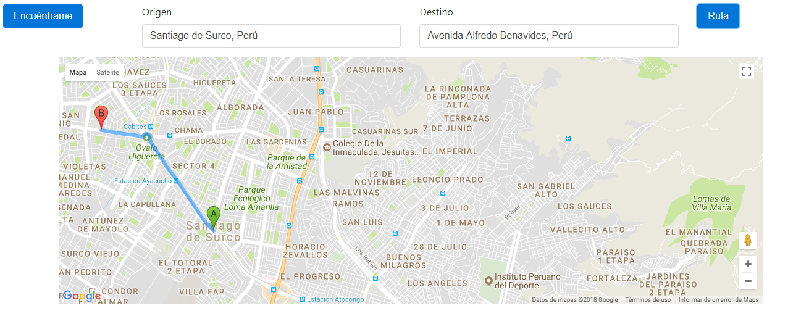
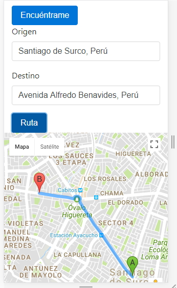

# EASY VRECO

**OBJETIVO** 
.Realizar una ruta facil y rapida para als personas ciclistas.

##FUENTES IMPORTANTES

Realmente me he ayudado con videos tutoriales, algunos foros. Pero nada como el LMS. Fue la fuente que mas utilice.

### Funcionalidad

**Vista desktop**

**Vista mobile**

### Herramientas Utilizadas

.Html5
__________________________________________________________________________________________________
.API geolocalización, para encontrar al usuario y trazar la ruta.
__________________________________________________________________________________________________
.Css3
__________________________________________________________________________________________________
.JS6
__________________________________________________________________________________________________
.Jquery
__________________________________________________________________________________________________
.Bootstrap4
__________________________________________________________________________________________________
